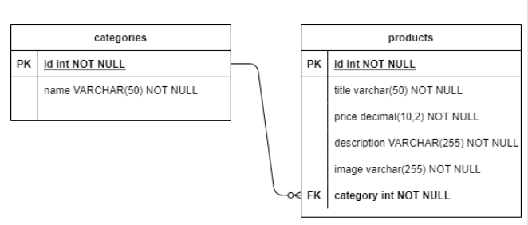

# Checkpoint Integrador

## Introdução

Olá Houser, como você está? Ao longo das aulas de Back-end, Front-end e Infraestrutura, temos trabalhado no desenvolvimento de aplicações onde as funcionalidades são construídas de maneira evolutiva. Contudo, a esta altura, uma pergunta que pode surgir é: Como eu estabeleço conexão entre o Back-end e o Front-end? Ou ainda: Como eu faço para publicar esta aplicação em um servidor na web?

Fique tranquilo, pois vamos desvendar juntos este mistério, guiando-o até a solução. Portanto, acompanhe-nos nesta jornada e seja bem-vindo à CTD Commerce.

Durante os últimos dois anos, especialmente em virtude do isolamento social, as pessoas modificaram seus hábitos de consumo. Em geral, muitas pessoas têm optado por fazer suas compras pelo comércio eletrônico. Para termos uma ideia, o e-commerce brasileiro cresceu cerca de 72% no primeiro trimestre de 2021 (comparado com o mesmo período de 2020) e o ticket médio de compras subiu 9,4% chegando a R$447,90, segundo o relatório da empresa de consultorias NeoTrust¹.


A CTD Commerce é uma empresa que atua neste segmento de mercado e desenvolve soluções em comércio eletrônico. Neste projeto, temos que desenvolver um protótipo de e-commerce para um dos clientes da CTD Commerce.
Atentem-se para o briefing que o cliente da CTD Commerce passou para o desenvolvimento deste protótipo.

## Requisitos Back-end:

1. Você deverá fazer o back-end de nosso e-commerce em Java com o Framework Spring no modelo MVC.
2. O banco de dados deverá ser o H2.
3. Modelo de dados: O banco de dados terá duas entidades principais, products e categories. Onde cada produto tem apenas uma categoria e cada categoria pode ter vários ou nenhum produto.
Segue o modelo para o banco de dados:



## O projeto deverá disponibilizar uma API com quatro end-points:

**Método GET** - https://ctdcommerce.com/products: <br>
este end-point deverá disponibilizar os dados de todos os produtos cadastrados em um JSON com o formato que segue:
```json
[
  {
    "id": 1,
    "title": "Produto 1",
    "price": 100.0,
    "category": "Categoria 1",
    "description": "Descrição do produto 1",
    "image": "https://via.placeholder.com/150"
  },
  {
  }
]
```

**Método GET** - https://ctdcommerce.com/products/1: <br>
este end-point deverá disponibilizar os dados de um produto específico em um JSON  com o formato que segue:
```json
  {
    "id": 1,
    "title": "Produto 1",
    "price": 100.0,
    "category": "Categoria 1",
    "description": "Descrição do produto 1",
    "image": "https://via.placeholder.com/150"
  }
```

**Método GET** - https://ctdcommerce.com/products/categories: <br>
este end-point deverá disponibilizar uma lista de categorias cadastradas em um JSON  com o formato que segue:
```json
[
  "Categoria 1",
  "Categoria 2",
  "Categoria 3"
]
```

**Método GET** - https://ctdcommerce.com/products/category/jewelery: <br>
este end-point deverá disponibilizar os produtos de uma determinada categoria, em um JSON  com o formato a seguir:
```json
[
  {
    "id": 1,
    "title": "Produto 1",
    "price": 100.0,
    "category": "jewelery",
    "description": "Descrição do produto 1",
    "image": "https://via.placeholder.com/150"
  },
  {
  }
]
```

